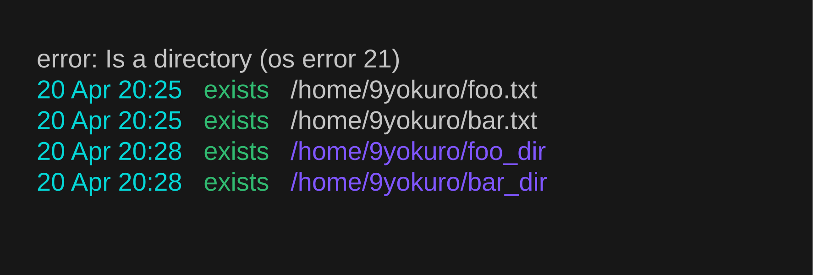

# Wmk - A file creation tool written


## Features
- Colorful, easy-to-read output
- History

mkdir and touch:
```bash
mkdir --parents a/b/c/d/e/f/
touch a/b/c/d/e/f/g.txt
```
wmk:
```bash
wmk a/b/c/d/e/f/g.txt
```

## Installation
Run the following Cargo command:
```bash
cargo install wmk
```

## Usage
Create files:
```bash
wmk foo.txt bar.txt ...
```


Create directories:
```bash
wmk --directory foo_dir bar_dir ...
```


Show history:
```bash
wmk --show-history

02 Mar 10:37   exists   /absolute/path/to/foo.txt
02 Mar 10:37   exists   /absolute/path/to/bar.txt
02 Mar 10:37   exists   /absolute/path/to/foo_dir
02 Mar 10:37   exists   /absolute/path/to/bar_dir
```


Delete history interactively:
```bash
wmk --delete-history
```

Clear history:
```bash
wmk --clear-history
```

### Options
```bash
-c, --clear-history   Clear history
-D, --delete-history  Delete history interactively
-d, --directory       Create directories instead of files
-q, --quiet           Do not print log messages
-R, --no-record       Do not create a history file
-s, --show-history    Show history
-h, --help            Print help
-V, --version         Print version
```
## License

Licensed under either of

 * Apache License, Version 2.0
   ([LICENSE-APACHE](LICENSE-APACHE) or http://www.apache.org/licenses/LICENSE-2.0)
 * MIT license
   ([LICENSE-MIT](LICENSE-MIT) or http://opensource.org/licenses/MIT)

at your option.

## Contribution

Unless you explicitly state otherwise, any contribution intentionally submitted
for inclusion in the work by you, as defined in the Apache-2.0 license, shall be
dual licensed as above, without any additional terms or conditions.
